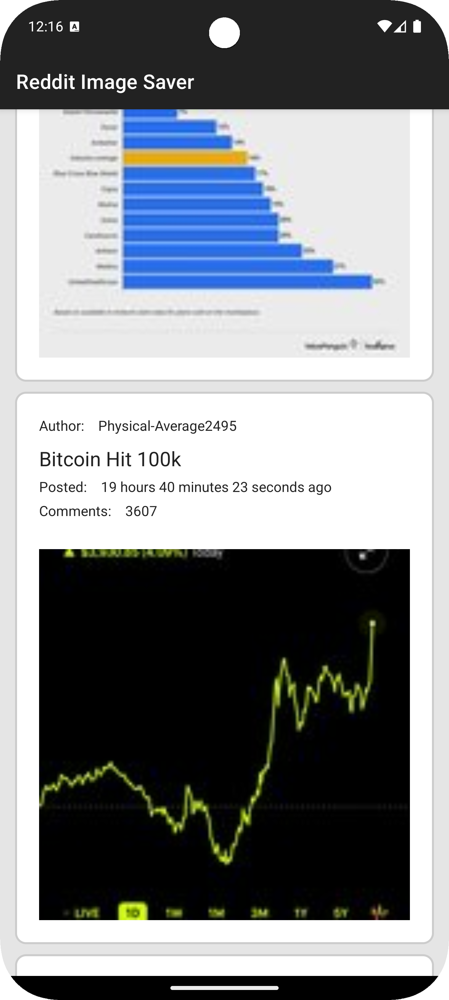
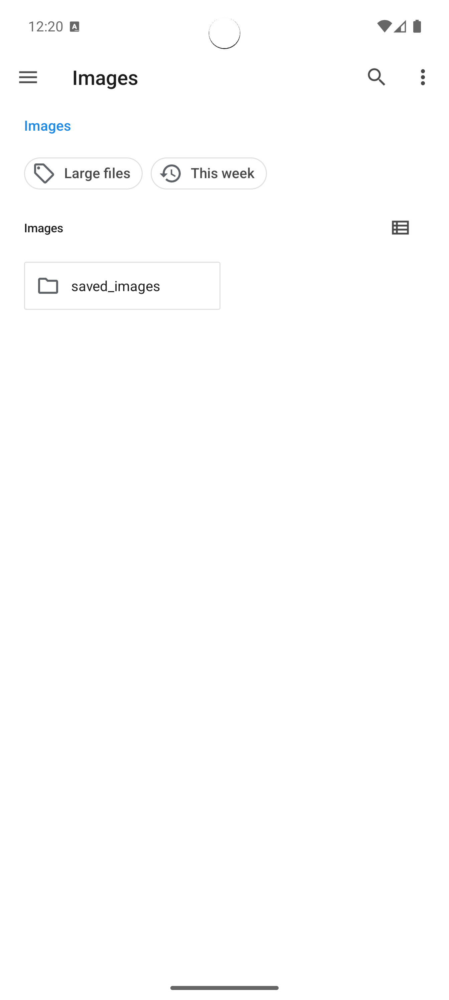
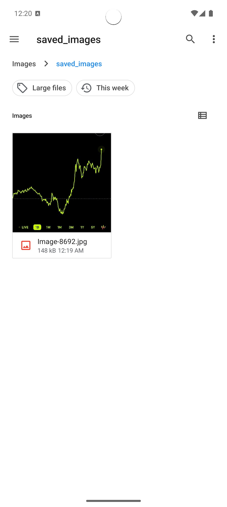

# 🏞️ Riddle Image Saver (Kotlin)

**Riddle Image Saver** is a test assignment completed in 2020. The project demonstrates how to retrieve and parse JSON data from a web source without using popular parsing libraries like Gson or Retrofit, as well as implement custom image loading and caching without Glide or Picasso.

---

## 📑 Key Features

- **Manual JSON Parsing**:  
  Fetch data via `HttpURLConnection` and parse it using `JSONObject`, avoiding libraries like Gson or Retrofit.

- **Custom Image Caching**:  
  Load and cache images locally without using Glide or Picasso. A custom `ImageLoader` with `FileCache` and `MemoryCache` is implemented to optimize image loading.

- **Local Database (SQLite)**:  
  Store post data (author, title, publication time, image URLs) locally, ensuring faster loading and offline availability.

- **Infinite Scrolling**:  
  Automatically loads more posts as the user scrolls, creating a seamless browsing experience.

- **Full-Screen Image Viewing & Saving**:  
  Tap a post image to view it full-screen. A save button is available to download and store the image directly on the device.

---

## 🛠️ Technologies and Approaches

- **Kotlin** as the primary language.
- **No Gson/Retrofit/Glide**: All networking and JSON parsing done manually.
- **SQLite** for local data caching.
- **RecyclerView** for displaying posts in a grid layout (2 images per row).

Check the `build.gradle` file for dependencies.

---

## 📸 Screenshots

|  |  |
|---------------------------|---------------------------|
|  |  |

---

## 📅 About the Project

- Development Year: **2020**
- Type: Test assignment to showcase Android development skills without common libraries.

---

## 🚀 How to Run

1. Clone the repository.
2. Open it in Android Studio.
3. Run on a device or emulator (API 23+).

---

## 👨‍💻 About Me

I am an Android developer who enjoys exploring various solutions and approaches. Feel free to reach out if you have any questions!